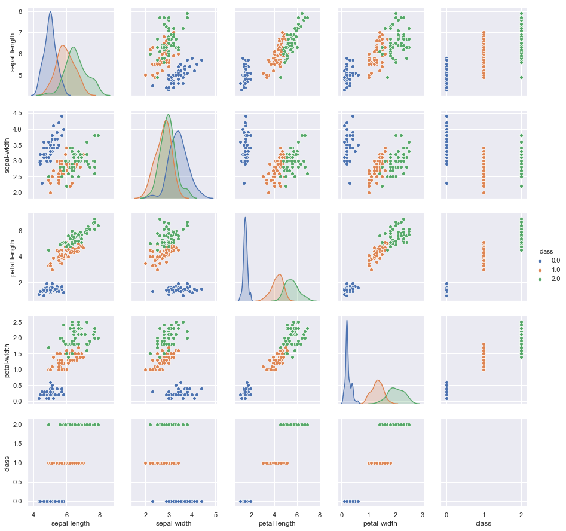
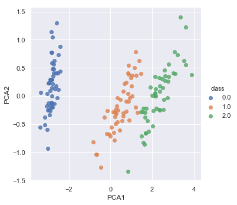
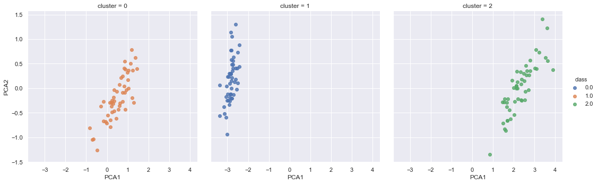
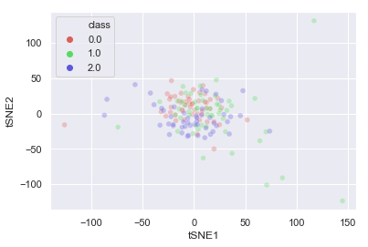

```python
import numpy as np 
import pandas as pd
from sklearn import model_selection
from sklearn.datasets import load_iris   
from sklearn.model_selection import train_test_split

iris_dataset=load_iris() 
print(f'dataset data shape: {iris_dataset["data"].shape}')
print(f'dataset target shape: {iris_dataset["target"].shape}')

iris_pd=pd.DataFrame(data=np.concatenate([iris_dataset["data"],iris_dataset["target"][...,None]],axis=1),
            columns=['sepal-length', 'sepal-width', 'petal-length', 'petal-width', 'class'])  # 1st row as the column names
print(f'dataframe peek:\n{iris_pd.head()}')
print(f'dataframe describe:\n{iris_pd.describe()}')

```

    dataset data shape: (150, 4)
    dataset target shape: (150,)
    dataframe peek:
       sepal-length  sepal-width  petal-length  petal-width  class
    0           5.1          3.5           1.4          0.2    0.0
    1           4.9          3.0           1.4          0.2    0.0
    2           4.7          3.2           1.3          0.2    0.0
    3           4.6          3.1           1.5          0.2    0.0
    4           5.0          3.6           1.4          0.2    0.0
    dataframe describe:
           sepal-length  sepal-width  petal-length  petal-width       class
    count    150.000000   150.000000    150.000000   150.000000  150.000000
    mean       5.843333     3.057333      3.758000     1.199333    1.000000
    std        0.828066     0.435866      1.765298     0.762238    0.819232
    min        4.300000     2.000000      1.000000     0.100000    0.000000
    25%        5.100000     2.800000      1.600000     0.300000    0.000000
    50%        5.800000     3.000000      4.350000     1.300000    1.000000
    75%        6.400000     3.300000      5.100000     1.800000    2.000000
    max        7.900000     4.400000      6.900000     2.500000    2.000000
    


```python
%matplotlib inline
import matplotlib.pyplot as plt
import seaborn as sns; sns.set()
sns.pairplot(iris_pd, hue='class')

```


    <seaborn.axisgrid.PairGrid at 0x19b2e7e3080>





```python
from sklearn.linear_model import LogisticRegression
from sklearn.tree import DecisionTreeClassifier
from sklearn.neighbors import KNeighborsClassifier
from sklearn.discriminant_analysis import LinearDiscriminantAnalysis
from sklearn.naive_bayes import GaussianNB
from sklearn.svm import SVC
from sklearn.neural_network import MLPClassifier
X_train,X_test,Y_train,Y_test = train_test_split(iris_dataset["data"], iris_dataset["target"],test_size=0.25,random_state=0)
scoring ='accuracy'
models = [
    LogisticRegression(solver='liblinear', multi_class='ovr'),
    LinearDiscriminantAnalysis(),
    KNeighborsClassifier(),
    DecisionTreeClassifier(),
    GaussianNB(),
    SVC(gamma='auto'),
    MLPClassifier(hidden_layer_sizes=(10,5),activation='tanh',max_iter=800,
      learning_rate_init=0.005,learning_rate='adaptive'),
]
for model in models:
	kfold = model_selection.KFold(n_splits=5, random_state=6) # seed
	cv_results = model_selection.cross_val_score(model, X_train, Y_train, cv=kfold, scoring=scoring)
	print(f"{type(model).__name__} : {cv_results.mean():.4f} ({cv_results.std():.4f})")    

```

    LogisticRegression : 0.9289 (0.0458)
    LinearDiscriminantAnalysis : 0.9735 (0.0350)
    KNeighborsClassifier : 0.9553 (0.0288)
    DecisionTreeClassifier : 0.9372 (0.0459)
    GaussianNB : 0.9470 (0.0513)
    SVC : 0.9727 (0.0545)
    MLPClassifier : 0.9731 (0.0362)
    


```python
from sklearn.decomposition import PCA
model = PCA(n_components=3)
model.fit(iris_pd)
X_2D = model.transform(iris_pd)
iris_pd['PCA1'] = X_2D[:, 0]
iris_pd['PCA2'] = X_2D[:, 1]
sns.lmplot("PCA1", "PCA2", hue='class', data=iris_pd, fit_reg=False)

```


    <seaborn.axisgrid.FacetGrid at 0x19b306439e8>





```python
from sklearn.mixture import GaussianMixture
model = GaussianMixture(n_components=3,covariance_type='full')
model.fit(iris_pd)
y_gmm = model.predict(iris_pd)

iris_pd['cluster'] = y_gmm
sns.lmplot("PCA1", "PCA2", hue='class', data=iris_pd, col='cluster', fit_reg=False);

```





```python
from sklearn.manifold import TSNE
tsne = TSNE(n_components=3, verbose=1, perplexity=40, n_iter=300)
tsne_results = tsne.fit_transform(iris_pd)
iris_pd['tSNE1'] = tsne_results[:, 0]
iris_pd['tSNE2'] = tsne_results[:, 1]
# plt.figure(figsize=(16,10))
# sns.lmplot("tSNE1", "tSNE2", hue='class', data=iris_pd, fit_reg=False)
sns.scatterplot(
    x="tSNE1", y="tSNE2",
    hue="class",
    palette=sns.color_palette("hls", 3),
    data=iris_pd,
    alpha=0.3
)
# sns.lmplot("tSNE1", "tSNE2", hue='class', data=iris_pd, fit_reg=False)

```

    [t-SNE] Computing 121 nearest neighbors...
    [t-SNE] Indexed 150 samples in 0.000s...
    [t-SNE] Computed neighbors for 150 samples in 0.028s...
    [t-SNE] Computed conditional probabilities for sample 150 / 150
    [t-SNE] Mean sigma: 1.108569
    [t-SNE] KL divergence after 250 iterations with early exaggeration: 104.468521
    [t-SNE] KL divergence after 300 iterations: 2.426404
    


    <matplotlib.axes._subplots.AxesSubplot at 0x19b302e4470>




